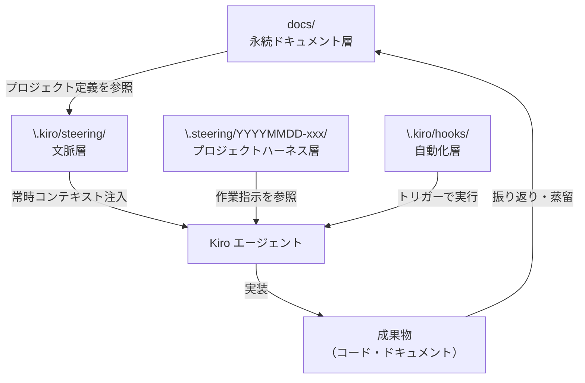
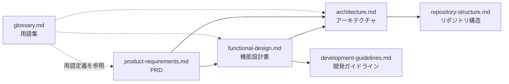
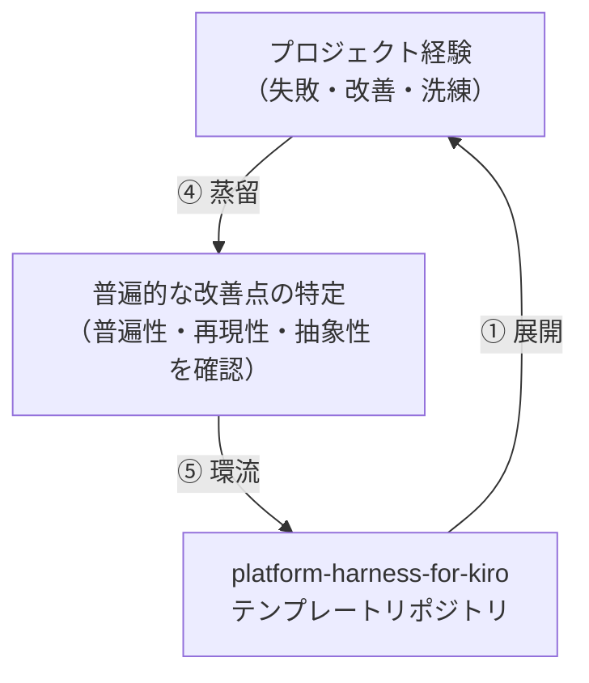

# 技術仕様書 (Architecture Design Document)

## このドキュメントの位置づけ

本プロジェクトの成果物はコードではなく「テンプレートリポジトリ」である。従来の実行系システムとは異なり、「ファイルの構造と内容がアーキテクチャである」という前提で記述する。

## ハーネスアーキテクチャ概要

Kiro ハーネスは **4 つの責務層** で構成される。各層は独立して機能し、上位層が下位層に依存する一方向の関係を持つ。

```
┌────────────────────────────────────────────────┐
│  文脈層（Context Layer）                        │
│  .kiro/steering/                               │
│  → LLM に「何者か・何をすべきか」を常時伝える   │
├────────────────────────────────────────────────┤
│  プロジェクトハーネス層（Spec Layer）            │
│  .steering/YYYYMMDD-xxx/                       │
│  → 作業単位の「何を・どう・どの順で」を定義する  │
├────────────────────────────────────────────────┤
│  自動化層（Automation Layer）                   │
│  .kiro/hooks/                                  │
│  → 定型作業をトリガーで自動実行する              │
├────────────────────────────────────────────────┤
│  永続ドキュメント層（Document Layer）            │
│  docs/                                         │
│  → プロジェクト全体の「北極星」を保持する        │
└────────────────────────────────────────────────┘
```

### 層間の情報フロー



## 文脈層アーキテクチャ（`.kiro/steering/`）

### 設計方針

Kiro の steering ファイルは、エージェントの全会話コンテキストに注入されるマークダウンファイル群である。Claude CLI ハーネスの CLAUDE.md を3層に分解して対応させる。

### ファイル構成と inclusionMode

| ファイル | 役割 | inclusionMode | Claude CLI 対応 |
|---------|------|--------------|----------------|
| `process.md` | 開発プロセス原則（普遍的ルール） | `always` | CLAUDE.md 汎用層 |
| `product.md` | プロダクト固有定義 | `always` | CLAUDE.md プロダクト固有層 |
| `tech.md` | 技術スタック・主要コマンド | `always` | CLAUDE.md 技術スタック固有層 |
| `structure.md` | リポジトリ構造定義 | `always` | repository-structure.md の要約 |

**全ファイルを `always` とする理由**: スペック駆動開発では、エージェントがどの作業をしていても常にプロジェクトの全文脈を把握している必要がある。条件付き（`auto`/`manual`）では、文脈が欠落したままエージェントが判断するリスクがある。

### steering ファイルのフォーマット仕様

```markdown
---
inclusion: always
---

# [ファイル名に対応したタイトル]

[内容]
```

フロントマター（`---` で囲まれた YAML ブロック）で `inclusion` を指定する。テンプレートの各ファイルには記入ガイドをコメントで含める。

### CLAUDE.md との関係・移行方針

CLAUDE.md の3層構造を Kiro steering に分解する際の対応表:

| CLAUDE.md セクション | 移行先 steering ファイル | 備考 |
|---------------------|------------------------|------|
| 汎用層（スペック駆動開発原則） | `process.md` | ほぼそのまま転記 |
| プロダクト固有層（docs/ 一覧等） | `product.md` | プロダクトごとにカスタマイズ |
| 技術スタック固有層 | `tech.md` | devcontainer は除外 |
| ディレクトリ構造 | `structure.md` | repository-structure.md の要約版 |

## プロジェクトハーネス層アーキテクチャ（`.steering/`）

### 設計方針

**Kiro の built-in specs 機能（`.kiro/specs/`）は使用しない**（設計指針3に基づく）。作業単位のスペックは Claude CLI ハーネスと同一の `.steering/YYYYMMDD-xxx/` 構造で管理する。

### ディレクトリ構造

```
.steering/
├── _template/              # テンプレート（直接編集しない）
│   ├── requirements.md     # 要求仕様テンプレート
│   ├── design.md           # 設計テンプレート
│   └── tasklist.md         # タスクリストテンプレート
├── 20250115-add-login/     # 機能実装時に作成（コピーして命名）
│   ├── requirements.md     # ← _template/ からコピーして記入
│   ├── design.md
│   └── tasklist.md
└── 20250120-fix-auth/      # 別の作業
    └── ...
```

### 命名規則

```
YYYYMMDD-[タスク名（英小文字・ハイフン区切り）]
```

例: `20250115-add-user-profile`, `20250120-fix-login-bug`

### 各テンプレートファイルの必須要素

**`requirements.md`**:
- 関連 GitHub Issue URL（必須）
- ユーザーストーリー
- 受け入れ条件（チェックリスト）
- スコープ外の明示

**`design.md`**:
- 実装アプローチ
- 変更対象ファイル一覧
- 技術的判断と根拠

**`tasklist.md`**:
- チェックリスト形式のタスク
- 「実装 → テスト → ドキュメント更新」の順序

### Kiro エージェントへの参照方法

`.steering/` は `.kiro/` の外にあるため、Kiro がデフォルトで参照しない可能性がある。以下で対応する:

1. `process.md` に「作業開始時は `.steering/[作業名]/requirements.md` を読むこと」を明記する
2. 作業開始時にエージェントに対して対象スペックファイルを明示的に指示する

## 自動化層アーキテクチャ（`.kiro/hooks/`）

### 設計方針

- Kiro GUI の範囲内で完結するフックのみ定義する（CLI 手動実行を前提としない）
- フックはエージェントへの追加指示として機能させる
- フック数は最小限に留め、必須でないものはテンプレートに含めない

### フックファイルのフォーマット仕様（受け入れテストで確認済み）

Kiro のフックは JSON 形式で `.kiro/hooks/` に配置する。

**共通スキーマ**:
```json
{
  "name": "string (required)",
  "version": "string (required)",
  "description": "string (optional)",
  "when": {
    "type": "fileEdited | userTriggered | postTaskExecution",
    "patterns": ["glob (fileEdited の場合)"]
  },
  "then": {
    "type": "askAgent | runCommand",
    "prompt": "string (askAgent の場合 required)",
    "command": "string (runCommand の場合 required)"
  }
}
```

**トリガー種別**:

| `when.type` | 説明 | `patterns` |
|---|---|---|
| `fileEdited` | 指定パターンのファイル保存時 | 必須（glob 配列） |
| `userTriggered` | Hook UI / コマンドパレットから手動実行 | 不要 |
| `postTaskExecution` | タスク完了後に自動実行 | 不要 |

**`fileEdited` の例**（tasklist-check.json）:
```json
{
  "name": "tasklist-check",
  "version": "1.0.0",
  "when": {
    "type": "fileEdited",
    "patterns": [".steering/**/tasklist.md"]
  },
  "then": {
    "type": "askAgent",
    "prompt": "..."
  }
}
```

**`userTriggered` の例**（ユーザーが手動起動するワークフロー）:
```json
{
  "name": "add-feature",
  "version": "1.0.0",
  "description": "新機能の SDD フローを開始する",
  "when": {
    "type": "userTriggered"
  },
  "then": {
    "type": "askAgent",
    "prompt": "新機能の実装を SDD フローで開始します。まず機能名を教えてください。..."
  }
}
```

### カスタムエージェントのフォーマット仕様

カスタムエージェントは `.kiro/agents/` ディレクトリに `.md` ファイルとして定義する。

```markdown
---
name: エージェント名
description: エージェントの役割説明
---

エージェントへのシステムプロンプト（役割・動作・出力形式を記述）
```

- チャットで `@エージェント名` と入力して呼び出す
- `postTaskExecution` hook と組み合わせてタスク完了後に自動起動も可能

### `inclusion` モードの使い分け

| モード | 動作 | 用途 |
|---|---|---|
| `always` | 全会話に常時注入 | process.md・product.md 等のコアコンテキスト |
| `manual` | チャットで `#ファイル名` と入力した時のみ読み込む | スキル相当の詳細ガイド（必要な時だけロード） |

### テンプレートに含めるフック

| フック名 | トリガー | 目的 |
|---------|---------|------|
| `tasklist-check.json` | `fileEdited` (.steering/**/tasklist.md) | 未完了タスクの確認促進 |
| `add-feature.json` | `userTriggered` | SDD フルサイクルを起動 |
| `setup-project.json` | `userTriggered` | docs/ 初期セットアップを起動 |

> **注意**: フック API の詳細は Kiro のバージョンに依存する。本スキーマは 2026-06-03 時点の受け入れテストで確認したもの。
>
> **既知の制約（2026-06-03 確認）**: `userTriggered` フックは Hook UI / コマンドパレットからのボタン起動が現バージョンでは非対応。ただしエージェントがフックファイルを認識・読み込めるため、チャットで「[hook名] を実行して」と指示することで同等の動作を得られる。

## 永続ドキュメント層アーキテクチャ（`docs/`）

### 設計方針

Claude CLI ハーネスと同一の 6 ドキュメント構成を維持する。ドキュメントは Kiro の steering ファイルから参照されるが、steering ファイル自体には要約のみを記載し、詳細は `docs/` を参照させる。

### ドキュメント間の依存関係



### `docs/ideas/` の役割

壁打ち・ブレインストーミングの成果物を自由形式で保管する。`/setup-project` 実行時（Claude CLI 環境）または steering ファイル作成時の参考資料として使用する。

## テンプレートカスタマイズアーキテクチャ

### カスタマイズの3段階

テンプレートを利用するエンジニアは、以下の3段階でカスタマイズする:

```
① 必須カスタマイズ（新規プロジェクト開始時）
   .kiro/steering/product.md  ← プロダクト概要を記入
   .kiro/steering/tech.md     ← 技術スタックを記入

② 推奨カスタマイズ（プロジェクトが安定したら）
   docs/ 各ドキュメント       ← 詳細なプロジェクト定義を記述
   .kiro/steering/structure.md ← リポジトリ構造を反映

③ 任意カスタマイズ（必要に応じて）
   .kiro/hooks/               ← プロジェクト固有フックを追加
   .steering/_template/       ← テンプレートを改善
```

### 環流（Feedback Loop）アーキテクチャ



蒸留の判断基準（以下すべてに該当する場合のみ環流対象）:
- **普遍性**: どのプロジェクトでも有効か（技術スタック・クラウド非依存）
- **再現性**: 同じ問題が他のプロジェクトでも起こりうるか
- **抽象性**: プロジェクト固有の値（URL・ID等）を含まないか

## ファイルフォーマット仕様

| ファイル種別 | フォーマット | 理由 |
|------------|------------|------|
| steering ファイル | Markdown + YAML フロントマター | Kiro のネイティブ形式 |
| hooks | JSON | Kiro のネイティブ形式 |
| specs（`.steering/`） | Markdown | 人間と LLM 双方が読み書きしやすい |
| 永続ドキュメント（`docs/`） | Markdown | バージョン管理・差分確認が容易 |
| MCP 設定 | JSON（`.kiro/settings/mcp.json`） | Kiro のネイティブ形式 |

## 環境設定戦略（devcontainer 非依存）

devcontainer は「一貫した開発環境を Docker コンテナで再現する」仕組みであり、除外することで以下の役割を別手段で担う必要がある。

### devcontainer が担っていた役割と代替手段

| devcontainer の役割 | 代替手段 | 担い手 |
|-------------------|---------|-------|
| ランタイムバージョンの固定 | バージョン管理ファイル（`.python-version`, `.nvmrc`, `.tool-versions` 等） | プロジェクト |
| 依存パッケージの再現 | ロックファイル（`uv.lock`, `package-lock.json` 等） | プロジェクト |
| OS 差異の吸収 | OS 別セットアップ手順のドキュメント化 | ハーネス（テンプレート提供） |
| 環境セットアップの自動化 | Kiro hooks による起動時チェック・ガイド（限定的） | ハーネス（フック提供） |
| 拡張機能・設定の統一 | `.kiro/settings/` / `.vscode/` の共有 | ハーネス（設定テンプレート提供） |

### ハーネスの責務範囲

このハーネスは「環境を作る」のではなく、**「環境を記述・案内する枠組みを提供する」** ことを責務とする。

```
ハーネスが提供するもの:
  - tech.md テンプレート（環境記述の書き方を規定）
  - development-guidelines.md テンプレート（セットアップ手順の記述場所を提供）
  - バージョン固定ファイルのひな型

プロジェクトが担うもの:
  - 具体的なランタイムバージョンの選定・記述
  - OS 別セットアップ手順の記述
  - CI/CD 環境の設定
```

### `tech.md` テンプレートに含める環境設定セクション

プロジェクトが `tech.md` をカスタマイズする際に記述すべき内容を規定する:

```markdown
## 環境要件

| 項目 | 内容 |
|------|------|
| 必須ランタイム | Python 3.12 / Node.js 22 など |
| バージョン固定ファイル | .python-version / .nvmrc / .tool-versions |
| パッケージマネージャー | uv / npm / pnpm など |
| ロックファイル | uv.lock / package-lock.json |

## 環境セットアップ（OS 別）

### macOS
[手順]

### Windows
[手順]

### Linux
[手順]
```

### バージョン固定ファイルの方針

devcontainer の代替として、ランタイムバージョンはリポジトリ内のファイルで固定する。ハーネスのテンプレートにはプレースホルダーのみを含め、プロジェクトが具体値を記入する。

| ファイル | 対象 | 対応ツール |
|---------|------|---------|
| `.python-version` | Python バージョン | pyenv / uv |
| `.nvmrc` | Node.js バージョン | nvm / fnm |
| `.tool-versions` | 複数ランタイム一括 | asdf |

### OS 差異への対応方針

devcontainer なしでは Windows / macOS / Linux の差異が顕在化する。以下の原則で対応する:

1. **ハーネス自体は OS 非依存**: steering ファイル・hooks・テンプレートはすべて Markdown / JSON であり、OS に依存しない
2. **OS 依存の手順はドキュメントに隔離**: セットアップ手順等の OS 差異は `docs/development-guidelines.md` に OS 別セクションとして記述する
3. **hooks のコマンドは注意が必要**: フックに OS 固有コマンドを含める場合、クロスプラットフォーム対応を明示するかプロジェクト側に委ねる

### Kiro 設定ファイルによる環境統一

devcontainer の「拡張機能・IDE 設定の統一」機能は、Kiro の設定ファイルで部分的に代替する:

```
.kiro/
└── settings/
    ├── mcp.json       # MCP サーバー設定（プロジェクト固有）
    └── agents.json    # カスタムエージェント設定（任意）
```

## 技術的制約

### 環境要件

| 要件 | 内容 |
|------|------|
| IDE | Kiro（バージョン指定は Kiro の安定版最新に追従） |
| OS | Kiro が対応する OS（Windows / macOS / Linux） |
| Docker | 不要（設計指針2に基づく） |
| kiro-cli | 不要（設計指針1に基づく）。プロジェクトのビルド・テスト等で端末を使うことは妨げない |

### Kiro バージョン依存リスクへの対応

Kiro は新しい IDE であり、API 仕様の変更リスクがある。以下の方針でリスクを低減する:

1. **steering ファイル**: Markdown 形式であり Kiro の仕様変更に強い
2. **hooks**: Kiro の仕様変更で壊れる可能性がある。テンプレートに含めるフックを最小限にし、バージョンアップ時の更新コストを低減する
3. **`.kiro/specs/` 不使用**: built-in specs は仕様変更リスクが高いため除外済み（設計指針3）

### MCP 設定の管理方針

| 種別 | 配置場所 | 管理主体 |
|------|---------|---------|
| プラットフォーム共通 MCP | ユーザー設定（Kiro のグローバル設定） | 個人 |
| プロジェクト固有 MCP | `.kiro/settings/mcp.json` | リポジトリ |

テンプレートには `.kiro/settings/mcp.json` の空のひな型のみを含め、実際のサーバー設定はプロジェクト側で記入する。

## ブートストラップ戦略

### このリポジトリのメタ構造

このリポジトリは **Claude CLI 環境を使って Kiro ハーネスを設計・実装する** という入れ子構造を持つ。これはコンパイラのブートストラップ（新しいコンパイラを旧言語で書いて初版を作り、その後自分自身でコンパイルするように移行する）と同じ構造である。

```
Bootstrap フェーズ（Claude CLI が主役）
  └── Claude CLI を使って Kiro ハーネスを設計・実装する
        ↓ 完成
Kiro で動作確認フェーズ
  └── 実際に Kiro を開いて受け入れテストを実施する
        ↓ 合格
リリースフェーズ（Kiro ユーザーが使い始める）
  └── テンプレートとして公開・共有する
        ↓ 将来
自走フェーズ（Kiro が主役）
  └── Kiro ハーネス自体の改善を Kiro 上で行う
  └── Claude CLI 環境（.claude/ 等）は任意のタイミングで削除可能
```

### フェーズごとの定義と移行条件

| フェーズ | 説明 | 移行条件 |
|---------|------|---------|
| **Bootstrap** | Claude CLI でハーネスを設計・実装する | `docs/` の全ドキュメント完成、`.kiro/` と `.steering/` の全テンプレートファイル作成完了 |
| **Kiro 動作確認** | Kiro を開いて受け入れテストを実施する | 後述の受け入れテスト全項目が合格 |
| **リリース** | Kiro ユーザーが使い始める | 動作確認フェーズ合格後。**Claude CLI 環境は残したまま公開してよい** |
| **自走** | Kiro ハーネスで自分自身を改善する | 任意。Kiro 単独でハーネス改善が完結できると判断したタイミング |

### Claude CLI 環境の削除タイミング

`.claude/`・`CLAUDE.md`・`skills/`・`memory/` 等の Claude CLI アーティファクトは **自走フェーズに入ってから任意のタイミングで削除する**。リリース時点では残しておいてよい。

削除してよい条件:
- Kiro ハーネスを使って、このリポジトリ自体の改善作業が Kiro 上で完結できること
- Claude CLI 環境がなくても困らないことを実際に確認できていること

> **重要**: Kiro ユーザーが使い始められるのはリリースフェーズ（動作確認合格後）であり、自走フェーズ（Claude CLI 削除）より前である。「Claude CLI を消す」と「Kiro ユーザーが使える」は別のイベントであることに注意する。

## テスト戦略（テンプレート検証）

コードテストは存在しない。テンプレートの品質は以下で担保する。

### 受け入れテスト（Kiro 動作確認フェーズの合格条件）

**これが「リリース可能か」の唯一のゲート。** Kiro を実際に開いて人間が確認する。自動化はできない。

**テスト手順**:
1. このリポジトリを GitHub で "Use this template" して新しいリポジトリを作成する
2. 作成したリポジトリを Kiro で開く
3. 以下のシナリオを順番に実行する

**シナリオ1: 文脈層の確認**
- [ ] `.kiro/steering/` の全ファイルが Kiro エージェントのコンテキストに反映されている（Kiro のコンテキスト表示で確認）
- [ ] エージェントにプロダクトについて質問したとき、`product.md` の内容を踏まえた回答が返ってくる

**シナリオ2: スペックフローの確認**
- [ ] `.steering/_template/` を Kiro GUI でコピーし `YYYYMMDD-test-feature/` として配置できる
- [ ] `requirements.md` を記入し、エージェントが内容を理解した上で `design.md` 作成を支援してくれる
- [ ] `tasklist.md` に従って、エージェントが1つのタスクを実際に実装できる

**シナリオ3: 制約の確認**
- [ ] kiro-cli を一切使わずに上記シナリオ1・2が完結できる
- [ ] Docker / devcontainer なしの環境（ローカル環境のみ）で動作する

**シナリオ4: テンプレートとしての確認**
- [ ] `.kiro/steering/product.md` を編集してプロダクト概要を記入できる
- [ ] `.kiro/steering/tech.md` を編集して技術スタックを記入できる
- [ ] 編集後、エージェントの回答が更新された内容を反映している

### ドキュメント品質チェックリスト

受け入れテストとは別に、以下をセルフチェックする:

- [ ] 各 steering ファイルに `<!-- 例: ... -->` 形式の記入ガイドが含まれている
- [ ] README.md のセットアップ手順が GUI 操作のみで記述されている（kiro-cli コマンドが含まれていない）
- [ ] 概念マッピング表（`docs/functional-design.md`）の全項目に対応要素または代替手段が記述されている
- [ ] Bootstrap フェーズ・リリース・自走フェーズの説明が README.md に記載されている
