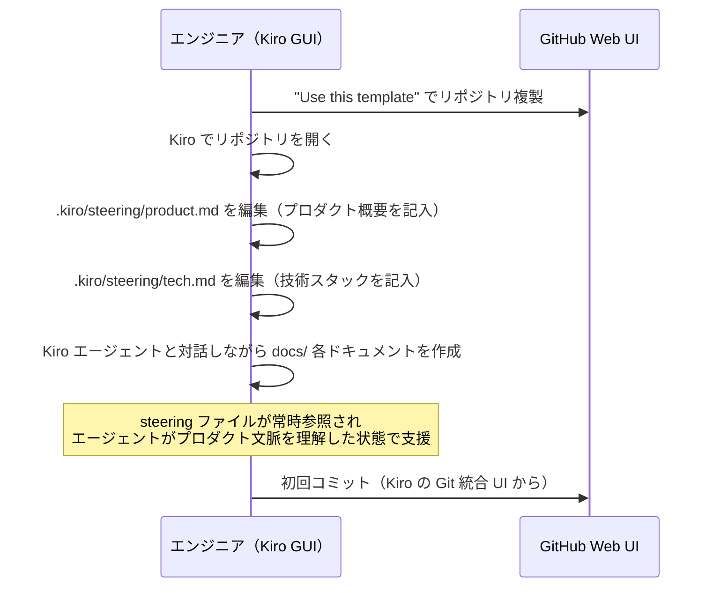
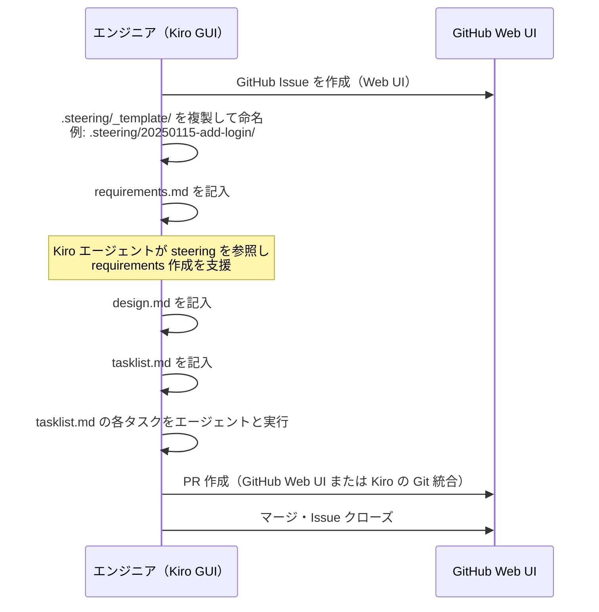
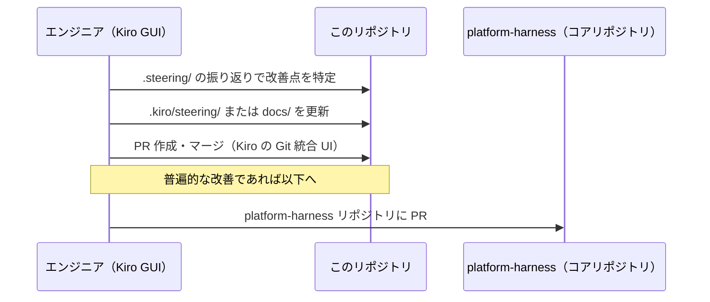

# 機能設計書 (Functional Design Document)

## 設計指針

このハーネスの設計は、以下の指針に基づく。各指針には採用根拠を明記し、将来の設計判断の基準として機能させる。

---

### 指針1: Kiro GUI 完結（kiro-cli 不使用）

**方針**: 全操作を Kiro IDE の GUI 内で完結させる。ターミナルや kiro-cli の手動操作を前提としない。

**根拠**:
- Claude CLI ハーネスは CLI に習熟したユーザーを前提としていたが、Kiro への移行に伴い CLI を使いこなせないユーザー層の利用を想定する
- Kiro は IDE として GUI 操作を主軸に設計されており、GUI 完結が Kiro のネイティブ体験に合致する

**影響範囲**:
- セットアップ手順は GUI 操作のみで記述する（README）
- hooks の定義はエンジニアが手動 CLI 実行することを前提としない
- `.kiro/steering/process.md` に「kiro-cli は使わない」ことを明示する

---

### 指針2: devcontainer 非依存

**方針**: ハーネスは devcontainer に依存しない。docker が使えない環境でも動作することを前提とする。devcontainer が担っていた役割（環境の再現性・OS 差異の吸収）は、ドキュメントとバージョン固定ファイルで代替する枠組みをハーネスが提供する。

**根拠**:
- Docker を利用できない環境（企業セキュリティポリシー・PC スペック制限等）のユーザーの利用を想定する
- devcontainer はプロジェクト固有の関心事であり、プラットフォームハーネスに含めるべきではない

**影響範囲**:
- `.kiro/steering/tech.md` のテンプレートに devcontainer を記述せず、代わりに OS 別セットアップ手順の記述欄を設ける
- ランタイムバージョンは `.python-version` / `.nvmrc` / `.tool-versions` 等のバージョン固定ファイルで管理するひな型を提供する
- devcontainer が必要なプロジェクトはプロジェクト側で追記する（ハーネスは妨げない）
- OS 差異への対応方針と代替手段の詳細は `docs/architecture.md`「環境設定戦略」セクションを参照

---

### 指針3: Kiro built-in specs 機能を使用しない

**方針**: Kiro の built-in specs 機能（`.kiro/specs/`）は使用しない。作業単位のスペックは `.steering/YYYYMMDD-xxx/` 構造で管理する。

**根拠**: 2026-06-03 に AWS 公式リポジトリを調査し、以下を確認した。

| 調査対象 | 確認内容 |
|---|---|
| [`awslabs/aidlc-workflows`](https://github.com/awslabs/aidlc-workflows)（AWS AI-DLC） | 「Spec mode 切り替えプロンプトには『No』で応答」と明示。Kiro が built-in specs への移行を促しても拒否するよう指示している |
| [`awsdataarchitect/kiro-best-practices`](https://github.com/awsdataarchitect/kiro-best-practices) | `.kiro/specs/` ディレクトリへの言及なし。steering + hooks のみで構成されている |

AWS 自身が提供するハーネスが built-in specs を積極的に回避していることは、built-in specs の安定性・柔軟性に問題があることを示唆している。

**追加理由**:
- built-in specs の動作仕様は Kiro のバージョンアップで変更されるリスクがある
- `.steering/YYYYMMDD-xxx/` 構造は Claude CLI ハーネスと同一であり、経験者の移行コストが低い
- CLI 不使用（指針1）とも矛盾しない（ファイル編集は Kiro GUI で完結）

**影響範囲**:
- `.kiro/specs/` ディレクトリはテンプレートに含めない
- Kiro が「Spec mode に切り替えますか？」と提示した場合は断るよう `.kiro/steering/process.md` に明記する
- 作業単位スペックのテンプレートは `.steering/_template/` に配置する

## システム構成図

このプロジェクトの成果物は「テンプレートリポジトリ」である。コード実行システムではなく、ファイル群の設計が主体となる。

```mermaid
graph TB
    subgraph "Kiro ハーネス（テンプレートリポジトリ）"
        subgraph "文脈層 (.kiro/steering/)"
            S1[product.md<br/>プロダクト定義]
            S2[tech.md<br/>技術スタック]
            S3[structure.md<br/>リポジトリ構造]
            S4[process.md<br/>開発プロセス原則]
        end

        subgraph "プロジェクトハーネス層 (.steering/)"
            SP1[YYYYMMDD-xxx/<br/>requirements / design / tasklist]
            SP2[_template/<br/>テンプレート]
        end

        subgraph "自動化層 (.kiro/hooks/)"
            H1[ファイル保存時フック]
            H2[その他トリガーフック]
        end

        subgraph "永続ドキュメント層 (docs/)"
            D1[product-requirements.md]
            D2[functional-design.md]
            D3[architecture.md]
            D4[repository-structure.md]
            D5[development-guidelines.md]
            D6[glossary.md]
            D7[ideas/]
        end
    end

    User[エンジニア<br/>（Kiro GUI のみ使用）] -->|常時参照| S1
    User -->|常時参照| S2
    User -->|常時参照| S3
    User -->|常時参照| S4
    User -->|機能実装時に作成| SP1
    User -->|自動実行| H1
    User -->|プロジェクト全体の定義| D1
```



## Claude CLI ハーネスと Kiro の概念マッピング

| Claude CLI 要素 | Kiro 対応要素 | 対応状態 | 備考 |
|----------------|-------------|---------|------|
| CLAUDE.md 汎用層（開発プロセス原則） | `.kiro/steering/process.md` | ✅ 完全移植 | inclusion: always |
| CLAUDE.md プロダクト固有層 | `.kiro/steering/product.md` | ✅ 完全移植 | inclusion: always |
| CLAUDE.md 技術スタック固有層 | `.kiro/steering/tech.md` | ✅ 完全移植 | inclusion: always |
| `docs/` 永続ドキュメント群 | `docs/` | ✅ 完全移植 | 構造は同一 |
| `.steering/YYYYMMDD-xxx/` 作業単位スペック | `.steering/YYYYMMDD-xxx/`（同一構造） | ✅ 完全移植 | Kiro built-in specs は使用しない |
| `settings.json` hooks（Stop） | `.kiro/hooks/` (`when.type: agentStop`) | ✅ 移植済み | tasklist-check.json。機械的ブロックではなく、応答完了ごとの継続指示注入で翻訳（agentStop のブロック能力は Kiro 公式ドキュメントで文書化されていないため依存しない）。PostToolUse のリマインドフックは対応外（agentStop で毎ターン確認されるため役割が重複） |
| `.mcp.json` MCP 設定 | `.kiro/settings/mcp.json` | ✅ 完全移植 | パス・形式が異なる |
| `.claude/commands/` スラッシュコマンド | `.kiro/hooks/` (`when.type: userTriggered`) + `.kiro/steering/`（詳細手順） | ✅ 移植済み | add-feature.json / setup-project.json。引数渡し不可のためプロンプト内で問い返す。詳細手順は JSON に押し込めず manual steering（`#skill-add-feature` 等）に置く。review-docs は個別移植せず `@doc-reviewer` の直接呼び出しで代替 |
| `.claude/skills/` on-demand 指示書 | `.kiro/steering/` (`inclusion: manual`) | ✅ 移植済み | チャットで `#ファイル名` と入力してロード。skill-sdd-guide / skill-doc-writing / skill-add-feature / skill-distill。1:1 移植ではなく、文書作成系スキル群（PRD・機能設計・アーキテクチャ等）は skill-doc-writing に統合 |
| `.claude/agents/` サブエージェント | `.kiro/agents/` カスタムエージェント | ✅ 移植済み | `@エージェント名` で呼び出し。implementation-validator / doc-reviewer |
| `memory/` 永続メモリ（記憶層） | **適用しない** | — | Kiro にセッション横断のネイティブ永続メモリ機構がないため、CLAUDE.md 汎用層の「記憶層の運用」は Kiro 版には適用しない。「memory/ の代替設計」セクションの steering / docs への記述で代替する |
| worktree 隔離（/add-feature） | フィーチャーブランチ必須 | ✅ 翻訳済み | 指針1（GUI 完結）に合わせ、Kiro Git 統合 UI でのブランチ作成に翻訳。「main で実装しない」規律は維持 |
| 4段検証（静的検証・/verify・/code-review・validator） | 3段検証（静的検証・実挙動確認・@implementation-validator） | ✅ 翻訳済み | 実挙動確認（/verify 相当）はビルトインなしの手動観察として存置し、コードレビュー段（/code-review 相当）のみ省略（Kiro に相当ビルトインがないため） |
| devcontainer | **ハーネス対象外** | — | プロジェクト固有で管理 |
| kiro-cli | **使用しない** | — | 全操作を Kiro GUI で完結 |

## コンポーネント設計

### 文脈層: `.kiro/steering/`

Kiro の steering ファイルは、エージェントの全コンテキストに常時注入される（Claude CLI の CLAUDE.md に相当）。全て Kiro GUI 上のファイル編集で管理する。

#### `process.md`（開発プロセス原則）

**責務**: スペック駆動開発の普遍的な原則を定義する（CLAUDE.md 汎用層に相当）

**設定**:
```yaml
inclusionMode: always
```

**含める内容**:
- スペック駆動開発の基本フロー（ドキュメント → 作業スペック → 実装 → 検証 → 環流）
- 作業単位スペック（`.steering/YYYYMMDD-xxx/`）の使い方
- `docs/` の更新ルール
- PR・リリースフロー（GitHub の Web UI で操作することを前提とした記述）
- 「kiro-cli は使わない」ことの明示

---

#### `product.md`（プロダクト固有定義）

**責務**: プロダクト固有の文脈を定義する（CLAUDE.md プロダクト固有層に相当）

**設定**:
```yaml
inclusionMode: always
```

**含める内容**:
- プロダクト概要・ビジョン
- 永続ドキュメント一覧（`docs/` 配下）
- プロダクト固有のルール・制約

---

#### `tech.md`（技術スタック定義）

**責務**: 技術スタック・主要操作を定義する（CLAUDE.md 技術スタック固有層に相当）

**設定**:
```yaml
inclusionMode: always
```

**含める内容**:
- 技術スタック（言語・フレームワーク・ツール）
- devcontainer は記述しない（プロジェクトが必要とする場合はプロジェクト側で追記）
- テスト・リント等の主要コマンド（フックから自動実行されるものを含む）

---

#### `structure.md`（リポジトリ構造定義）

**責務**: リポジトリのディレクトリ構造を定義する

**設定**:
```yaml
inclusionMode: always
```

---

### プロジェクトハーネス層: `.steering/_template/`

機能実装ごとに Kiro GUI でコピーして使うテンプレート群。Claude CLI の `.steering/YYYYMMDD-xxx/` と同等。

#### ディレクトリ命名規則

```
.steering/
├── _template/          # テンプレート（直接編集しない）
│   ├── requirements.md
│   ├── design.md
│   └── tasklist.md
└── 20250115-add-login/ # 機能実装時に作成（コピーして命名）
    ├── requirements.md
    ├── design.md
    └── tasklist.md
```

#### `requirements.md`（要求仕様テンプレート）

**含める内容**:
- 関連 GitHub Issue の URL（必須記入欄）
- ユーザーストーリー形式の要求定義
- 受け入れ条件（チェックリスト）
- スコープ外の明示

---

#### `design.md`（設計テンプレート）

**含める内容**:
- 実装アプローチ
- 変更対象ファイルの一覧
- 技術的な判断と根拠

---

#### `tasklist.md`（タスクリストテンプレート）

**含める内容**:
- チェックリスト形式のタスク
- 各タスクの完了基準
- 「実装 → テスト → ドキュメント更新」の順序

---

### 自動化層: `.kiro/hooks/`

Kiro のフック機能を使って定型作業を自動化する。Claude CLI の `settings.json` hooks に相当。kiro-cli を必要とするフックは定義しない。

#### フック設計方針

- エンジニアが CLI を手動実行することを前提とした設計はしない
- フックはあくまで Kiro のエージェントへの追加指示として使用する

#### 定義するフック

| フック名 | トリガー | 実行内容 |
|---------|---------|---------|
| `tasklist-check` | `agentStop`（エージェントの応答完了時） | 最新の作業スペックの tasklist.md に未完了タスク（`- [ ]`）が残っていれば、完了・分割・技術的スキップのいずれかまで作業継続を促す（Claude CLI の Stop フックの翻訳。未完了がなければ何もしない） |
| `add-feature` | `userTriggered` | 新機能の SDD フロー（`#skill-add-feature`）を開始する |
| `setup-project` | `userTriggered` | docs/ の6ドキュメントを承認ゲート付きで対話作成する |

> **注意**: フック機能の具体的な API・トリガー種別は Kiro のバージョンに依存する。`agentStop` のシェルコマンドによるブロック能力は公式ドキュメントで文書化されていないため、tasklist-check は agent プロンプト（継続指示の注入）方式とし、ブロック能力には依存しない。

---

### 永続ドキュメント層: `docs/`

Claude CLI ハーネスと同一の 6 ドキュメント構成。

```
docs/
├── ideas/                      # 壁打ち・ブレインストーミング（自由形式）
├── product-requirements.md     # プロダクト要求定義書
├── functional-design.md        # 機能設計書
├── architecture.md             # 技術仕様書
├── repository-structure.md     # リポジトリ構造定義書
├── development-guidelines.md   # 開発ガイドライン
└── glossary.md                 # ユビキタス言語定義
```

## ワークフロー設計

全ワークフローは Kiro IDE の GUI 内で完結する。ターミナル・kiro-cli は不要。

### フロー1: 新規プロジェクトセットアップ



---

### フロー2: 機能開発（作業スペックフロー）



---

### フロー3: ハーネス環流



## ファイル構造

テンプレートリポジトリの完成形ファイル構成:

```
platform-harness-for-kiro/
├── .kiro/
│   ├── steering/
│   │   ├── process.md          # 開発プロセス原則（常時参照）
│   │   ├── product.md          # プロダクト固有定義（常時参照）
│   │   ├── tech.md             # 技術スタック定義（常時参照）
│   │   └── structure.md        # リポジトリ構造定義（常時参照）
│   └── hooks/
│       └── *.json              # 自動化フック（Kiro GUI で管理）
├── .steering/
│   └── _template/              # 機能実装時に複製するテンプレート
│       ├── requirements.md
│       ├── design.md
│       └── tasklist.md
├── docs/
│   ├── ideas/
│   │   └── .gitkeep
│   ├── product-requirements.md
│   ├── functional-design.md
│   ├── architecture.md
│   ├── repository-structure.md
│   ├── development-guidelines.md
│   └── glossary.md
└── README.md                   # セットアップガイド（GUI 操作ベース）
```

## memory/ の代替設計

Kiro にはセッション横断の永続メモリ機能がない。Claude CLI の `memory/` の役割を以下で代替する:

| memory の用途 | Kiro での代替手段 |
|-------------|----------------|
| ユーザープロファイル（ロール・好み） | `.kiro/steering/process.md` にチームの作業スタイルを記述 |
| フィードバック（修正・改善の記録） | `.kiro/steering/process.md` の注意事項セクションに記述 |
| プロジェクト固有の文脈 | `.kiro/steering/product.md` に記述 |
| 参照情報（外部リンク等） | `docs/` に記述 |

## テスト戦略

このリポジトリの「テスト」はコードテストではなく、テンプレートの動作確認を指す。

### テンプレート動作確認

- [ ] テンプレートを複製して、kiro-cli・ターミナルを一切使わずに最初の作業スペック作成を開始できること
- [ ] `.kiro/steering/` の内容が Kiro エージェントのコンテキストに反映されること
- [ ] `.steering/_template/` を Kiro GUI で複製して requirements.md → design.md → tasklist.md の順で記述できること
- [ ] `.kiro/hooks/` の定義がトリガー条件で正しく動作すること
- [ ] devcontainer なしの環境でテンプレートが問題なく使用できること

### ドキュメント品質確認

- [ ] 各 steering ファイルに `<!-- 例: ... -->` 形式の記入ガイドが含まれること
- [ ] README.md のセットアップ手順が GUI 操作のみで完結していること
- [ ] Kiro specs 機能を使う場合・使わない場合の両方の手順が記述されていること
